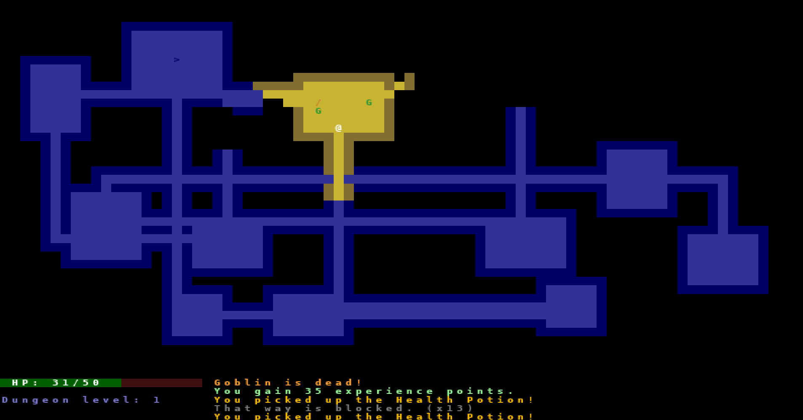

# Crypts Of Ruze
A Roguelike Inspired Dungeon Crawler




### Features
Procedural Generation: Every playthrough offers a unique dungeon layout.
Turn-Based Gameplay: Strategic combat and exploration, one step at a time.
Permadeath: Permanent consequences for your actions—no second chances!
Inventory System: Collect and manage weapons, armor, potions, and spells.
Character Development: Level up and enhance your abilities to survive deeper levels.


### Gameplay
You will explore a dungeon filled with enemies and treasures in this roguelike with the goal being to delve as deep as possible while managing your resources with your 24 inventory size limit and avoiding permadeath. As you progress and delve deeper into the dungeon, you will encounter tougher enemies and find better loot.


### Controls <br/>
**Main Menu** <br/>
[N] Key: New Game File <br/>
[C] Key: Continue Game File <br/>
[Q] Key: Quit Game <br/>


**In-Game** <br/>
Arrow Keys/WASD Keys: Movement <br/>
[Space] Key: Pick Up Items <br/>
[I] Key: Open Equip Items Menu  <br/>
[O] Key: Open Drop Items Menu <br/>
[A-Z] Keys: Select Items From Inventory Menus (Equip/Drop) <br/>
[1-4] Keys: Select Character Enchantment <br/>
[Shift] + [>] Keys: Decend To Next Floor <br/>
[M] Key: Open Character Sheet <br/>
[V] Key: Message/Log History <br/>
[ESC] Key: Exit Menus <br/>


### Installation
Run the following command in your terminal: 
```bash
pip install -r requirements.txt
```

### Usage
To start the game, run the following command in your terminal: 
```bash
python main.py
```

### Acknowledgments
This is a classic roguelike game built with Python, following the [Yet Another Roguelike Tutorial](https://rogueliketutorials.com/tutorials/tcod/v2/) and using the [TCOD library](https://python-tcod.readthedocs.io/en/latest/)
